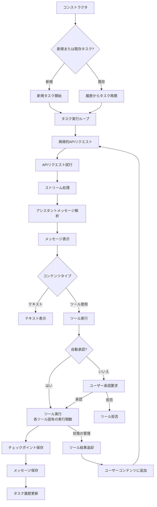

# フローチャートとその解説

## 解説

一連のやり取りを「タスク」とします。

1. タスクの初期化と実行
    - **タスク開始**: ユーザーからのメッセージを受け取り、新規タスクなら新規タスクとして、既存タスクなら今までのタスク履歴を取得する。
    - **タスク実行ループ**: AIアシスタントとの対話ループを開始。
    - **APIリクエスト**: AIアシスタントにプロンプトを送信。

2. メッセージの処理
    - **ストリーム処理**: AIアシスタントからの応答をストリームとして受信し、新たにメッセージを受け取るたびに処理。
    - **メッセージ解析**: アシスタントのメッセージをパース・読み込み、テキストかツール使用かに分類した上で適切に処理。
    - **メッセージ表示**: パースされたメッセージはユーザーに表示。

3. ツールの実行
    - **自動承認チェック**: ツール使用指示が検出されると、自動承認可能かどうかが判断。
    - **ユーザー承認**: 自動承認できない場合は、ユーザーに承認を求める。
    - **ツール実行**: 承認されたツールは、対応する実行関数によって処理。
    - **チェックポイント保存**: ツール実行後、現在の状態がチェックポイントとして保存。

4. 状態管理
    - **メッセージ保存**: 会話履歴を保存。
    - **タスク履歴更新**: タスク履歴を更新。
    - **ユーザーコンテンツ追加**: ツールの実行結果は次のAPIリクエスト送信時にユーザーコンテンツとしてメッセージに追加。

---

参考: https://zenn.dev/codeciao/articles/6d0a83e234a34a
